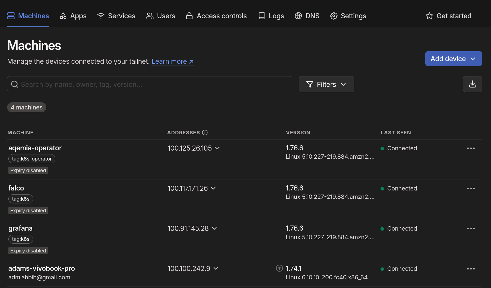

# TASK WRITEUP

# TASK AND LINKS FOR CHECKING ONCE DEPLOYED

# TIME SPENT

# LANGUAGES AND TOOLS

# ENVIRONMENT

## WORKSTATION

## NITROKEY

## GITHUB

## REPOSITORY STRUCTURE

### MONOREPO STRUCTURE

### BRANCHES AND PROTECTED MAIN BRANCH

### SECRET MANAGEMENT

## AWS

### INFRASTRUCTURE COMPONENTS

#### THE EKS CLUSTER

#### THE VPC AND SUBNETS

#### THE SECURITY GROUPS

#### THE S3 TFSTATE BUCKET

#### THE ECR REPOSITORY

### IAM ROLES

# INFRASTRUCTURE AS CODE

## TERRAFORM AND USED PROVIDERS

AWS

Kubernetes

Helm

Cloudflare

Kubectl

## TERRAFORM MODULES BREAKDOWN

# CI/CD PIPELINE

## MAKEFILE AND DOCKERFILE

## DOCKER COMPOSE

## GITHUB ACTIONS WORKFLOW

## PLAN INFRASTRUCTURE JOB

## TEST AND CODE SCANNING JOBS

### FLAKE8

### BANDIT

### TRUFFLEHOG

### GRYPE

## BUILD AND PUSH DOCKER IMAGE JOB

### DOCKER BUILDX

### DOCKER COMPOSE, PYTEST, AND PYCOV FOR CODE COVERAGE

## DEPANDABOT FOR DEPENDENCY UPDATES JOB

## SYNC AND BUILD INFRASTRUCTURE JOBS

## AUTOMATED DEPLOYMENT OF KUBERNETES RESOURCES WITH TERRAFORM JOB

## APPLICATION DEPLOYMENT JOB

### KUBERNETES NAMESPACES

### KUBERNETES DEPLOYMENTS

## CERTIFICATE MANAGEMENT

### CERT-MANAGER

## CLOUDFLARE DNS MANAGEMENT

## DESTROY INFRASTRUCTURE JOB

## SLACK NOTIFICATIONS

# MONITORING, LOGGING, AND DASHBOARDING

## PROMETHEUS

## GRAFANA

## LOKI

## PROMTAIL

## ALERTMANAGER

# TRACING

## TEMPO

# VPN RESTRICTED ACCESS

## TAILSCALE

# WAF, SECURITY PRACTICES, LOW-LEVEL MONITORING

## CLOUDFLARE

## FALCO AND EBPF

### FALCO SYSCALLS SLACK ALERTS

### FALCO SIDEKICK

## CROWDSEC

# ALERTING

## ALERTMANAGER

# WRAPPING UP

# IN ORDER TO TEST
