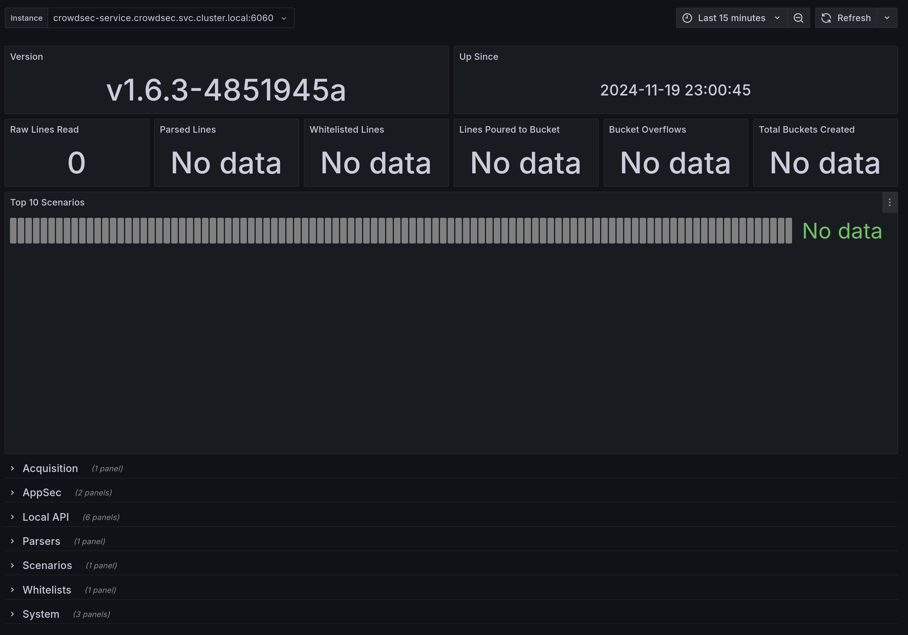

# TASK WRITEUP

# TASK AND LINKS FOR CHECKING ONCE DEPLOYED

For the following, a subdomain from my personal blog was used, which you can visit at https://admida0ui.de 🙂

- Production URL: https://aqemia.admida0ui.de/docs

- Slack for Alerts and Notifications (invited): https://adaml-test.slack.com/ 

Once connected to the Tailnet (invited):

- Grafana: https://monitoring.tailcf97d7.ts.net/

`admin:aqemia-operator` credentials (just for the task, I wouldn't write it in clear text otherwise)

- Falco Sidekick: https://falco.tailcf97d7.ts.net/

`admin:admin` credentials (just for the task, I wouldn't write it in clear text otherwise)

CrowdSec SaaS Dashboard: https://app.crowdsec.net
PS. CrowdSec also has Grafana Dashboards which are provisioned with Terraform.

Cloudflare: https://dash.cloudflare.com (I can invite)

GitHub (invited): https://www.github.com/adamlahbib/aqemia

# TIME SPENT

Over the course of 1 week, I focused on this task during weekend and monday/tuesday evenings to write the documentation. I spent around 8 hours to make the infrastructure, different pipelines, and monitoring setup.

I aimed for the documentation to be straight to the point highlighting the important parts and features of the work.

# LANGUAGES AND TOOLS

I was given a FAST API Python application to deploy therefore I used Python to write tests for the application.

I used HCL for writing the Terraform code for the infrastructure. According to GitHub stats, that's the dominant language in the repository.

I used a Dockerfile to build the application's Docker Image and a Makefile to control the build and tests processes with the help of Docker Compose.

GitHub Actions was the CI/CD tool of choice for this project and I used it not only to automate the build, test, and deployment processes but also to manage the infrastructure with Terraform.

AWS was the cloud provider of choice and I used EKS to deploy the Kubernetes cluster.

# ENVIRONMENT

## WORKSTATION

My personal laptop running Fedora Workstation with 8 GB of RAM and Intel I5 11th Gen processor.

## NITROKEY

Access to my laptop and GitHub commits are secured with a Nitrokey FIDO2 security key, which I use also for the Cloudflare account.

## GITHUB

GitHub is where my fork of the repository is located privately and where the CI/CD pipeline is running.

### MONOREPO STRUCTURE

The repository is structured as a monorepo with the following directories:
_DOCUMENTATION: This directory contains the documentation for the project.
.github/actions: This directory contains the GitHub Actions workflows modules used in the CI/CD pipeline.
.github/workflows: This directory contains the GitHub Actions workflows for the CI/CD pipeline.
app: This directory contains the FastAPI application.
app/tests: This directory contains the tests for the FastAPI application.
k8s/dev: This directory contains the Kubernetes resources (deployment and service) for the development environment.
k8s/prod: This directory contains the Kubernetes resources (deployment and service) for the production environment.
terraform: This directory contains the Terraform modules for the infrastructure components which will be explained further as we go along.

### BRANCHES AND PROTECTED MAIN BRANCH

The main branch is protected and requires a pull request to merge changes into it and deployments from the main branch are done to the prod namespace in the Kubernetes cluster.
The dev branch is used for development and deployments from the dev branch are done to the dev namespace in the Kubernetes cluster. 
Each pull request would trigger the test and code scanning jobs in the CI/CD pipeline and the Terraform plan job to check the infrastructure changes before merging only if any `*.tf` files are changed.
Depandabot is enabled to check for dependency updates and create pull requests for them.

### SECRET MANAGEMENT

The secrets are managed in the GitHub repository secrets and are used in the CI/CD pipeline for the deployment and infrastructure management.

Whenever Terraform needs a certain secret to be used, it is passed as a variable to the Terraform module from the GitHub Actions workflow.

## AWS

This section focuses on the AWS environment and the infrastructure components that were created.

### INFRASTRUCTURE COMPONENTS

#### THE S3 TFSTATE BUCKET

An S3 bucket was created to store the Terraform state file.

#### THE VPC AND SUBNETS

A VPC using a custom CIDR which is divided into private and public subnets across specified availability zones will be created in the Terraform module to deploy the EKS cluster.

#### THE SECURITY GROUPS

A Security group for the cluster in the previous VPC will allow inbound trafffic on ports 80 and 443 from the internet and outbound traffic to the internet.

#### THE ECR REPOSITORY

An ECR repository will be created supporting mutable image tags and a lifecycle rule to retain only the last 30 untagged images, expiring the rest. The repository is protected from accidental deletion so the Terraform destroy job will not delete it and therefore it must be deleted manually.

### IAM ROLES

It is a best practice not to use the root email account for the AWS account and to create an IAM user with the necessary permissions to manage the infrastructure as the client key and secret are used in Terraform.

The IAM roles created are:

- EKS Cluster Role: Allows EKS to manage AWS resources on your behalf. The `AmazonEKSClusterPolicy` provides ELS the necessary permissions to create and manage cluster resources.
- Worker Node Role: Allows worker nodes in the EKS Node Group to communicate with the EKS control plane. The `AmazonEKSWorkerNodePolicy` provides the necessary permissions to register with the EKS cluster, the `AmazonEC2ContainerRegistryReadOnly` policy allows the worker nodes to pull images from the ECR repository, the `AmazonEKS_CNI_Policy` grants permissions for networking tasks within the cluster.

#### THE WORKER NODE LAUNCH TEMPLATE

One difference I encountered between AWS and GCP is that in AWS, the worker nodes have a limited number of Kubernetes pods they can run and this is determined by the instance type. The launch template is an advanced feature that allows you to control the instance and customise it to your needs.

When I started designing the infrastructure, I wanted to be limited to the free tier and therefore I wanted to limit the cluster to 2 f3-micro instances which are the one of smallest instances available in the free tier and thus paying only for the Kuberentes costs. However, those were limited to 4 pods per instance which is given the amount of initial Kuberenetes cluster resources in the kube-system namesapce, I was left with only few pod-allocatable resources for the application pods.

I even tried with the launch template to increase the number of pods per instance which worked but still I faced a different issue in relation to the number of allocated IPs per the CNI plugin.

Therefore, I ended up relying on the larger f3-medium instances which have more pod-allocatable resources thanks to the launch template and more IPs allocated per instance, with the possibility to scale the cluster to 4 instances when needed.

#### THE EKS CLUSTER AND NODE GROUP

The EKS cluster is created with the latest version of Kubernetes and the node group has the desired capacity of 2 instances and the maximum capacity of 4 instances.

# INFRASTRUCTURE AS CODE

## TERRAFORM AND USED PROVIDERS

AWS Provider: Manages AWS resources, configured within the set region variable. 

Kubernetes Provider: Connects to EKS, using the cluster endpoint, token, and CA certificate.

Helm Provider: Interacts with Helm in EKS, using the Kubernetes endpoint and token. The `helm_release` resource is used to install the required Helm charts for the Nginx Ingress Controller, Cert-Manager, CrowdSec, Prometheus Operator, Grafana, Loki, Tempo, and Falco.

Cloudflare Provider: Authenticates with Cloudflare using the user token. The `cloudflare_record` resource is used to create the DNS records for the domain.

Kubectl: The `kubectl` command is used to apply the Kubernetes resources to the cluster. While the Kubernetes provider is used to manage the Kubernetes resources, the kubectl was used in cases when a certain resources would require CRDs to be installed from a Helm chart which was not possible with the Kubernetes provider at the time of applying the resources since the CRDs were not installed yet, kubectl applies resources to the cluster differently in such case and would succeed. 

Consult the following file: [provider.tf](../terraform/provider.tf)

## TERRAFORM MODULES BREAKDOWN

[provider.tf](../terraform/provider.tf): Contains the provider configurations.
[variables.tf](../terraform/variables.tf): Contains the variables used in the Terraform modules.
[backend.tf](../terraform/backend.tf): Contains the backend configuration for the Terraform state file.
[vpc.tf](../terraform/vpc.tf): Creates the VPC and subnets.
[sg.tf](../terraform/sg.tf): Creates the security group.
[ecr.tf](../terraform/ecr.tf): Creates the ECR repository.
[eks.tf](../terraform/eks.tf): Creates the EKS cluster and node group.
[monitoring.tf](../terraform/monitoring.tf): Creates the monitoring resources (Prometheus, Grafana, Loki, Tempo).
[security.tf](../terraform/security.tf): Creates the security resources (Falco, CrowdSec).
[ingress.tf](../terraform/ingress.tf): Contains Nginx Ingress Controller and Cert-Manager deployments along with the dev, prod, and monitoring ingress resources.
[dns.tf](../terraform/dns.tf): Creates the DNS records for the domain.
[tls.tf](../terraform/tls.tf): Contains the TLS certificate resources with the Cert-Manager.
[tailscale.tf](../terraform/tailscale.tf): Creates the Tailscale operator to restrict access to the Tailscale VPN tailnet.
[output.tf](../terraform/output.tf): Contains the outputs of the Terraform modules.

[stages/dev.tfvars](../terraform/stages/dev.tfvars): Contains the variables for the dev stage.
[stages/prod.tfvars](../terraform/stages/prod.tfvars): Contains the variables for the prod stage.

PS. I intended initially to create different Terraform enviornments that could be managed via Terraform workspaces and Terragrunt and have different variables. However, I ended up using just Cluster namespacing in the Kubernetes cluster to separate the dev and prod environments.

# CI/CD PIPELINE

## MAKEFILE, DOCKERFILE, AND DOCKER COMPOSE

Before I started with the CI/CD pipeline, I created a Makefile to control the build and test processes of the application and a Dockerfile to build the application's Docker image.

The Makefile uses Docker Compose to build the application and run the functional tests with Pytest and PyCov for code coverage, Flake8 for linting. It also can start the compose services and stop them.

The [Makefile](../Makefile) commands:
- `make build`: Builds the application.
- `make test`: Runs the functional tests.
- `make run`: Starts the compose services.
- `make clean`: Stops the compose services.

The [Dockerfile](../Dockerfile) was written in the most optimised way:
- Layering: The Dockerfile uses multi-stage builds (base, builder, final), which helps to keep the final image small and free of unnecessary dependencies.
- Cache Efficiency: The use of separate layers for installing dependencies and copying application code ensures that dependencies are only reinstalled when `requirements.txt` changes, reducing build times.
- Minimal Final Image: The final image only includes the runtime dependencies and the application code, keeping the image size small, which is around 50MB thanks to the Python3.11-slim base image too.

The [Docker Compose](../docker-compose.yaml) file was used to run the application and the tests whether locally or in the CI/CD pipeline. It exposes the application on port 8000.

## GITHUB ACTIONS WORKFLOW

As mentioned before, the GitHub Actions workflow is modular and its modules are stored in the `.github/actions` directory:

- build-push-image: Builds the Docker image and pushes it to the ECR repository.
- terraform-apply: Applies the Terraform modules to create or keep the infrastructure in sync.
- terraform-destroy: Destroys the infrastructure.
- terraform-plan: Plans the infrastructure changes (Used in Pull requests when there is a change affecting `*.tf` files).

For the actual pipelines, the `.github/workflows` directory contains the following workflows:

- sync-and-deploy.yaml: Syncs the infrastructure and deploys the application to the Kubernetes cluster in the prod namespace.
- dev-deploy.yaml: Contains the job to deploy the application to the Kubernetes cluster in the dev namespace.
- plan.yaml: Contains the job to plan the infrastructure changes when there is a change affecting `*.tf` files and is triggered on pull requests.
- test.yaml: Contains the jobs to run the tests and code scanning tools (Flake8, Bandit, Trufflehog, Grype, Functional Tests) during a pull request.
- destroy.yaml: A manual job to destroy the infrastructure.
- dependabot.yaml: Contains the job to check for dependency updates and create pull requests for them.

## PLAN INFRASTRUCTURE JOB

The plan infrastructure job uses `dflook` images to run the Terraform plan command and check for changes in the infrastructure. It is triggered on pull requests when there is a change affecting `*.tf` files. The output can be seen in the workflow logs as well as the pull request comments by the GitHub Actions bot.

## TEST AND CODE SCANNING JOBS

REFER TO THIS [JOB LOGS](https://github.com/adamlahbib/aqemia/actions/runs/11922712020/job/33229562109?pr=11)

### FLAKE8, PYTEST, AND PYCOV

Flake8 is a Python linting tool that checks the code for PEP8 compliance and other coding standards. The job is triggered on pull requests and runs the Flake8 tool on the container directly to check the code.

While the standard way is to setup Python during the pipeline runtime and install PIP then Flake8 and then build the application and run the different tests and code scanning tools. However this is just an extra overhead since we can just have the docker compose build the application then start the services (in our case `uvicorn` would not stop even if the code is broken) so if the build step passes, the Flake8 can possibly run within the container and check the code (being really lightweight) and would help gain a huge amount of time during the pipeline execution. That's the same reason why I prefer to have the practice of also running the functional tests within the container and generate the coverage report as well.

Flake8 runs [two commands](../Makefile), first focuses on critical errors e.g. syntax errors and undefined names, and the second looks for general issues such as code complexity and line length, to not interrupt the pipeline for ongoing development as long as the code is not broken or in critical shape, such issues are treated as warnings but still are reported in the logs and sent to Slack.

Pytest is a testing framework that allows for easy test creation and execution. I have written functional tests for the FastAPI application and they are run in the pipeline to ensure the application is working as expected simply by checking the health endpoint and its response. [test_health.py](../app/tests/test_health.py).

PyCov is a code coverage tool that measures the amount of code covered by the tests. The coverage report is generated in the pipeline.

### BANDIT

Bandit is a tool designed to find common security issues in Python code. To do this, Bandit processes each file, builds an AST from it, and runs appropriate plugins against the AST nodes. Once Bandit has finished scanning all the files, it generates a report.

### TRUFFLEHOG

TruffleHog is the most powerful secrets Discovery, Classification, Validation, and Analysis tool. In this context secret refers to a credential a machine uses to authenticate itself to another machine. This includes API keys, database passwords, private encryption keys, and more...

TruffleHog can look for secrets in many places including Git, chats, wikis, logs, API testing platforms, object stores, filesystems and more...

By using TruffleHog, we can ensure that no secrets are leaked outside the repository and the CI/CD pipeline and we can take action to remove them.

### GRYPE

Grype is a vulnerability scanner for container images and filesystems developed and maintained by Anchore and written in the Go programming language. Grype can scan from Docker, OCI, Singularity, podman, image archives, and local directory. Grype is compatible with SBOMs generated by Syft, and Grype’s vulnerability database draws from a wide variety of sources, including Wolfi SecDB.

### DEPANDABOT FOR DEPENDENCY UPDATES JOB

Dependabot is enabled to check for dependency updates and create pull requests for them. The job is triggered on a schedule and checks for updates to the dependencies in the `requirements.txt` file.

## BUILD AND PUSH DOCKER IMAGE JOB

### DOCKER BUILDX

Buildx is a Docker CLI plugin that extends the docker build command with the full support of the features provided by Moby BuildKit builder toolkit. It provides the same user experience as docker build with many new features like creating scoped builder instances and building against multiple nodes concurrently. But the most important feature for me in this context is its caching mechanism which is really efficient and can save a lot of time during the build process.

The pushed image to the ECR is tagged with the latest commit SHA along with the stage (dev/prod) and the latest tag.

## SYNC AND BUILD INFRASTRUCTURE JOBS

### SYNC INFRASTRUCTURE JOB

The Sync Terraform job: `terraform-apply` in the [sync-and-deploy.yaml file](../.github/workflows/sync-and-deploy.yaml), automates the deployment of infrastructure with Terraform in a streamlined and secure manner. It includes three main steps: Checkout, which fetches the code repository for execution; Terraform Apply, which uses a custom GitHub Action to apply the Terraform configuration with environment-specific variables like AWS credentials, Cloudflare API tokens, and Kubernetes settings; and Prepare Slack Notification, which ensures a clear status update is sent to a Slack channel, regardless of deployment success or failure. 

REFER TO THIS [JOB LOGS](https://github.com/adamlahbib/aqemia/actions/runs/11922627881/job/33229299694)

### APPLICATION DEPLOYMENT JOB

This Deploy API job: `deploy` in the [sync-and-deploy.yaml file](../.github/workflows/sync-and-deploy.yaml), automates the deployment of an API application after applying Terraform infrastructure changes. It proceeds through these key steps:

- Checkout: Fetches the full repository history to ensure accurate change detection.
- Check for Changes: Verifies if changes were made to the app directory, determining whether deployment is necessary.
- Build, Tag, and Push Image: Uses a custom action to build a Docker image, tag it, and push it to Amazon ECR, but only if relevant changes are detected.
- Update Kubeconfig: Configures kubectl to interact with the correct EKS cluster, conditioned on deployment necessity.
- Deploy to EKS: Applies Kubernetes manifests, dynamically replacing the image placeholder in the deployment.yaml file for the current stage.
- Verify Deployment: Ensures the deployment succeeds by monitoring its rollout status and reporting success or failure.

PROD: REFER TO THIS [JOB LOGS](https://github.com/adamlahbib/aqemia/actions/runs/11922627881/job/33229354469)

#### APPLICATION KUBERNETES MANIFESTS

The k8s folder contains the Kubernetes manifests for both environments:

For both environments, the deployment.yaml file is designed for efficiency and reliability through several thoughtful configurations:

- Namespace isolation: The application is scoped to the dev or prod namespace, ensuring a clear separation of environments.
- Dynamic Image Reference: The {{image}} placeholder is replaced with the latest image tag during deployment, ensuring the most recent version is used and ensuring the image is not tampered with or changed.
- Efficient Resource Allocation: Requests and limits are defined for CPU (100m - 500m) and memory (256Mi - 512Mi), ensuring efficient utilisation of cluster resources while preventing over-provisioning.
- Rolling Updates: Configured with `maxSurge: 1` and `maxUnavailable: 0`, enabling smooth rolling updates with zero downtime by maintaining availability during updates.
- Readiness Probe: An HTTP-based readiness probe check `/health` on container port 8000 with a delay of 15 seconds and a 10-second interval ensuring the container is ready to serve traffic.
- Scalable and Minimal Design: Starts with a single replica `(replicas: 1)` for development efficiency and two replicas for production, ensuring high availability and scalability.

The service.yaml file is namespace-scoped, label and selector-matched, and port-mapped to 80 for production and 8080 for development. It is also configured as a `ClusterIP` service, which is ideal for internal communication within the cluster and the Ingress, reducing exposure to external networks for enhanced security.

## DESTROY INFRASTRUCTURE JOB

The destroy infrastructure job uses the `dflook` images to run the Terraform destroy command. It is triggered manually, the tfstate file will be updated with the latest state of the infrastructure and the resources will be destroyed. The S3 bucket and the ECR repository are not destroyed and must be deleted manually in order to completely clean up the resources.

Of course, our infrastructure is 'portable' so it can be recreated by just having the pipeline run the Terraform apply job again in order to figure out the missing resources and recreate them.

# KUBERNETES NAMESPACES

We already mentioned that the Kubernetes cluster is namespaced into dev and prod namespaces. The dev namespace is used for the development environment and the prod namespace is used for the production environment.

As part of the automated Kuberentes resources deployment thanks to the Helm provider, the following namespaces are created:

- monitoring: Contains the monitoring resources (Prometheus, Grafana, Loki, Tempo).
- falco: Contains the Falco resources (Falco, Falco Sidekick).
- crowdsec: Contains the CrowdSec resources (CrowdSec, CrowdSec Sidekick).
- ingress-nginx: Contains the Nginx Ingress Controller resources.
- cert-manager: Contains the Cert-Manager resources.
- tailscale: Contains the Tailscale resources (Tailscale Operator).

# CERTIFICATE MANAGEMENT

## CERT-MANAGER

The Helm release uses the Jetstack Cert-Manager chart to ensure a secure and automated setup for TLS certificate management by deploying the Cert-Manager and its CRDs in the cert-manager namespace.

A Kubernetes secret stores the Cloudflare API token incoming from the GitHub Actions secrets and is used by the Cert-Manager to create the DNS-01 challenge for the domain through a ClusterIssuer resource for Let's Encrypt.

This integration streamlines certificate issuance and renewal with secure credentials and dependable automation.

# CLOUDFLARE DNS MANAGEMENT

The Cloudflare record resource dynamically configures a DNS record for the application within Cloudflare. It creates a CNAME record, using the hostname from Kubernetes service's load balancer, or defaults to 'PENDING_LB_HOTNAME' if the load balancer hostname is unavailable. However, I ensured that this step only runs after the Nginx Ingress Controller is deployed and ready. The `proxied` option enables Cloudflare's proxying for added security and performance benefits through the Cloudflare network, WAF, and powerful DDoS protection.

# SLACK NOTIFICATIONS

Slack notifications across different channels:

- deployments channel: For deployment status updates.
- qa channel: For test results and code scanning reports.
- falco-alerts channel: For Falco syscall alerts happening in the cluster (these can be limited to only critical alerts and all the notices would remain available on the Falco Sidekick dashboard).
- app-alerts channel: For application alerts and notifications incoming from Prometheus rules and Alertmanager.

By using a Slack webhook, the GitHub Actions workflow and the Prometheus operator can send messages to the Slack channels, providing real-time updates on the deployment status, test results, and security alerts.

Besides, we can define certain alerts based on the Grafana dashboard monitoring the cluster and have alerts being sent to different channels like Slack or Email.

# MONITORING, LOGGING, AND DASHBOARDING

I wouldn't say it is somewhat challenging to deploy the whole Prometheus stack at once as you have to keep rinsing and repeating the process until you get every variable right. Especially when you are configuring it through Terraform using the Helm provider.

So I gathered the necessary configuration after each trial and error and put them together in the chart values files as variable in the Terraform module.

Grafana itself had its own configuration to have the datasources and dashboards provisioned automatically.

Alertmanager was configured to send alerts to the Slack channel out-of-the-box.

And Prometheus had extra rules configured to send alerts to the Alertmanager, and extra scrapers to scrape the metrics from Crowdsec.

I will get into the details of each component in the following sections so don't worry 😉

## PROMETHEUS

Using the `kube-prometheus-stack` chart, the Prometheus Operator is deployed in the monitoring namespace. The Prometheus Operator manages the Prometheus instances and the different components of the Prometheus stack: Prometheus, Alertmanager, and Grafana.

Custom Configuration:

- Grafana: Configured with an HTTPS-enforced connection, and secure cookie configuration.
- Alertmanager: Enables integration with Slack for real-time alerts.
- Prometheus: Has rules configured to watch for critical CPU usage and HTTP request rates, which can be found here [alertmanager-config.yaml](../terraform/assets/alertmanager-config.yaml). Also, has an extra scraper to scrape the metrics from Crowdsec /metrics endpoint which in turn would be used to showcase Crowdsec findings and attacks in real-time in the Grafana dashboards.

### ALERT RULES

The configuration defines custom Prometheus alert rules for resource monitoring including:

- `HighRequestRate` Alert: Triggers if the HTTP request rate exceeds 100 requests/minute over a 5-minute window, signalling potential server overload.
- `HighCPULoad` Alert: Monitors CPU load, warning if the `node_load1` exceeds 80% for 5 minutes, indicating high system resource usage.

Each alert has a defined severity level and detailed annotation for quick identification and actionable responses.

## GRAFANA AND PRE-INSTALLED DASHBOARDS

Grafana is deployed as part of the Prometheus stack, providing a powerful dashboarding and visualisation tool for monitoring and observability. The Grafana dashboard is pre-configured with the necessary datasources and dashboards for the Prometheus, Alertmanager, Tempo and Loki data sources and two CrowdSec dashboards:

- Data Sources: Configure connections to Prometheus, Alertmanager, Tempo, and Loki with proxy access. Each data source is defined by its type, cluster URL, and access settings, with Prometheus being the primary data source for monitoring metrics.
- Dashboards: Add pre-configured JSON files as Grafana dashboards, such as [21419.json](../terraform/assets/21419.json) and [crowdsec_v5.json](../terraform/assets/crowdsec_v5.json) both used for CrowdSec monitoring and visualisation.

### GRAFANA CONFIGURATION

Both the data source and dashboard configurations are managed through a Kubernetes config map and once provisioned, the Grafana operator automatically picks up the changes and applies them to the Grafana instance.

### CROWDSEC DASHBOARDS

The 21419.json dashboard was downloaded from https://grafana.com/grafana/dashboards/21419-crowdsec/
and the crowdsec_v5.json dashboard is from the official CrowdSec Grafana dashboards repository on GitHub https://github.com/crowdsecurity/grafana-dashboards

## LOKI

Loki is a horizontally-scalable, highly-available, multi-tenant log aggregation system inspired by Prometheus. Loki differs from Prometheus by focusing on logs instead of metrics, and collecting logs via push, instead of pull.

## ALERTMANAGER

The Alertmanager handles alerts sent by client applications such as the Prometheus server. It takes care of deduplicating, grouping, and routing them to the correct receiver integration such as email, PagerDuty, or OpsGenie. It also takes care of silencing and inhibition of alerts.

# TRACING

## TEMPO

Tempo is an easy-to-operate, high-scale, and cost-effective distributed tracing system. Tempo can be used to oversee the performance of microservices and distributed systems, providing insights into latency, errors, and performance bottlenecks.

# KYVERNO

Kyverno is a policy engine designed for Kubernetes. It allows cluster administrators to enforce policies on resources in a Kubernetes cluster. Kyverno policies are written in YAML and can be used to enforce security, compliance, and operational best practices.

The following policies are enforced:

- Disallow privileged containers: Ensures that no privileged containers are deployed in the cluster.
- Disallow NodePort services: Ensures that no NodePort services are deployed in the cluster.
- Disallow Latest Tag: Ensures that no images are deployed with the latest tag.
- Disallow Default Namespace: Ensures that no resources are deployed in the default namespace.
- Allowed Replicas: Ensures that the number of replicas for a deployment is within a specified range.
- Allowed Container Registry: Ensures that the container registry used in the deployment is allowed.
- Require Resource Requests and Limits: Ensures that resource requests and limits are set for containers in a deployment.
- Require Pod Probe: Ensures that liveness and readiness probes are set for containers in a deployment.

# VPN RESTRICTED ACCESS

In my experience, I have seen that this is a must, having administrative endpoints and dashboards exposed to the internet is always a risk. Therefore, I used Tailscale to restrict access to the monitoring resources and security reports to the Tailscale tailnet users only whether they are administrators or a small team of operators.

This is achieved by installing the Tailscale operator in the cluster which will create a classname `tailscale` for Ingress resources and then the Ingress resources will be assigned a hostname and a TLS certificate for the specific tailnet domain. In the meantime Tailscale is working on making it possible to use custom domains or even CNAMES for the tailnet domain.

## TAILSCALE

[tailscale.yaml](../terraform/tailscale.yaml) contains the Tailscale operator configuration using the Client ID and secret for my tailnet.

Once both the Tailscale operator and its related Ingress resources are created, the monitoring resources are only accessible via the Tailscale tailnet domain for users who are part of and connected to the tailnet.

e.g. https://monitoring.tailcf97d7.ts.net to access Grafana which uses the `admin:aqemia-operator` credentials (just for the task, I wouldn't write it in clear text otherwise). The password was pre-set in the GitHub Actions secrets and the username is the default Grafana admin username.

# WAF, SECURITY PRACTICES, LOW-LEVEL MONITORING

## CLOUDFLARE

Cloudflare is a web infrastructure and website security company that provides content delivery network services, DDoS mitigation, Internet security, and distributed domain name server services. It is a reverse proxy, a web application firewall, and a distributed domain name server.

## FALCO AND EBPF

Falco is a runtime security tool that allows you to monitor the system calls and the kernel events happening in the cluster and detect any abnormal behaviour. It can be used to detect and alert on any abnormal behaviour happening in the cluster through its Falco sidekick which can send the alerts to Slack or any other alerting tool.

Falco uses eBPF to monitor the system calls before they reach the kernel. This is useful to prevent any privilege escalation or any other malicious activity happening in the cluster whether it is from an insider or an outsider (like a messing around developer, a third-party tool, or possibly an attacker).

### FALCO SYSCALLS SLACK ALERTS

We can limit the alerts to only critical alerts and all the notices would remain available on the Falco Sidekick dashboard. As that specific channel is currently receiving every action happening in the cluster.

### FALCO SIDEKICK

Falco Sidekick is a tool that listens to Falco events and sends them to different outputs like Slack, Email, or any other alerting tool. It also has its own dashboard where you can see the events happening in the cluster in real-time, and as it contains sensitive information, it is only accessible via the Tailscale tailnet at https://falco.tailcf97d7.ts.net. `admin:admin` for access.

## CROWDSEC

I have used Open-Appsec before, which is an ML-based Firewall and I have to say that CrowdSec is a great alternative to it. It is a modern behaviour-based security tool that can detect and block attacks in real-time.

CrowdSec is a free, modern & collaborative behavior detection engine, coupled with a global IP reputation network. It stacks on fail2ban's philosophy but is IPV6 compatible and 60x faster (Go vs Python), it uses Grok patterns to parse logs and YAML scenarios to identify behaviors. CrowdSec is engineered for modern Cloud / Containers / VM-based infrastructures (by decoupling detection and remediation). Once detected you can remedy threats with various bouncers (firewall block, nginx http 403, Captchas, etc.) while the aggressive IP can be sent to CrowdSec for curation before being shared among all users to further improve everyone's security. Quoted from their GitHub repository.

### IMPLEMENTATION

A dedicated namespace for CrowdSec is created in the Kubernetes cluster and the CrowdSec Helm chart is deployed within it along with randomly generated bouncer key as a secret, which is used later to help block malicious IPs reaching out the Ingress resources and the CrowdSec enroll key to connect to the CrowdSec SaaS dashboard.

[The CrowdSec values file](../terraform/assets/crowdsec-values.yaml) contains the configuration for the CrowdSec Helm chart, including the above mentioned keys. It configures the container_runtime, the local API LAPI, the CrowdSec Agent, and Prometheus metrics.

- The container runtime is set to containerd.
- The LAPI which is the component that allows CrowdSec machines (agents, API, etc.) to push alerts and decisions to a database, allow bouncers to consume said alerts and decision from the database, and allow cscli to view, add, or remove decisions. The LAPI is configured with optimised resource limits and metrics exposure.
- CrowdSec's agent is lightweight open source software that detects peers with aggressive behavior to prevent them accessing your systems.
- CrowdSec can expose a prometheus endpoint for collection (on http://127.0.0.1:6060/metrics by default). You can edit the listen_addr to 0.0.0.0 in config.yaml to allow an external Prometheus to scrape the metrics. On the Prometheus side we set the a scrape job to scrape the metrics from the CrowdSec agent.

The NGINX ingress controller is extended with the CrowdSec Lua bouncer plugin, dynamically initialised using extraInitContainers and configured to load CrowdSec's security policies directly. Volumes and volume mounts are carefully orchestrated to support the plugin’s functionality. This configuration can be found in the [crowdsec-ingress-nginx.yaml](../terraform/assets/crowdsec-ingress-nginx.yaml) file, and its application within the Ingress operator [here](../terraform/ingress.tf).

### CROWDSEC SAAS DASHBOARD

### CROWDSEC GRAFANA DASHBOARDS

PS. a fresh CrowdSec installation and no attacks were detected during the time of writing this documentation :/

# WRAPPING UP

This task was a great opportunity to showcase some of the best practices I followed in my career and to always try different tools like with the case of Crowdsec and Tailscale.

# IN ORDER TO TEST

I will leave the infrastructure running on AWS for few days and will be available to comment on the work and hear any feedback or suggestions you might have.

If you need some time I can take the infrastructure down and by just triggering the pipeline again, it will be recreated within 10 minutes.

As for the application, since the pipeline is triggered when there is a change in the app directory, you can just add a line to the README file and push it to the repository and the pipeline will be triggered and the application will be deployed to the Kubernetes cluster just for testing purposes.

Triggering the test pipeline require creating a pull request.

I hope you enjoy the work and the documentation as I really enjoyed making them and trying to make the infrastructure as secure, automated, and efficient as possible.

# THANK YOU A LOT AND LOOKING FORWARD TO HEARING FROM YOU! 😊

ADAM LAHBIB.
